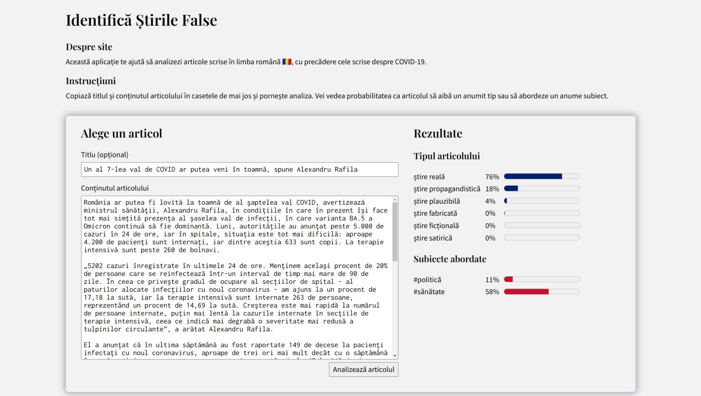

# Fake News Predictor

This is a small web application for analysing news articles written in Romanian
(mainly those about the COVID‑19 pandemic), in an attempt to detect fake news.

The application is written using Flask. Predictions are made by a Python model
available on [Hugging Face](https://huggingface.co/pandrei7/fakenews-mtl).

> **Disclaimer**: The predictions made by the application do not constitute
objective facts and do not reflect my opinion.



## Running the application

Before you follow these steps, make sure you have Python 3 installed. Also, keep
in mind that the model is quite large and might require **around 2GB of storage
space** and RAM.

First, clone this repository to a directory and `cd` into it.

```bash
git clone https://github.com/pandrei7/fake-news-app.git
cd fake-news-app
```

Before running the application, you need to download some Python dependencies.
You can do this using `pip`. Optionally, you might want to use a virtual
environment to prevent problems with different library versions.

```bash
# (Optional) Create a virtual environment and activate it.
python3 -m venv venv
source venv/bin/activate       # If using bash.
source venv/bin/activate.fish  # If using fish.

# Install the dependencies.
pip install -r requirements.txt
```

Now you should be able to run the application. The model should get downloaded
automatically the first time you run.

```bash
python3 main.py
```

Open your browser and access `localhost:8080`.
